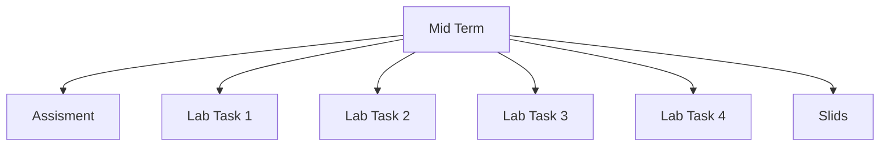

## 1. Stack
- Language: Arduino C/C++ (`.ino` sketches, e.g. `Mid Term/Assisment/P3/P3.ino`)
- Simulation: Labcenter Proteus ISIS/VSM project files (`.pdsprj`, `.pdsbak`, `.pdsprj.*.workspace`)
- Docs: PDF lab handouts (`LAB 1.pdf` etc.), PPTX lecture slides (`Mid Term/Slids/*.pptx`)
- No build/package manifest present (verified: no `package.json`, `go.mod`, `pyproject.toml`, or `Cargo.toml` at REPO_ROOT)

## 2. Directory map
| path | what lives there |
|---|---|
| `Mid Term` | course-unit root; contains all lab/assignment work |
| `Mid Term/Assisment` | Arduino sketches (`1a`, `1b`, `2b`, `P3`, `P4a`, `p4b`, `p4c`, `p5a`, `p5b`) + Proteus `.pdsprj`/`.pdsbak` files + `request.pdf` |
| `Mid Term/Lab Task 1` | `LAB 1.pdf` handout only |
| `Mid Term/Lab Task 2` | `Code/code1`, `Code/code2` sketches + Proteus projects + `LAB 2.pdf` |
| `Mid Term/Lab Task 3` | `Code2/code1`, `Code2/Code2`, `Code2/code3` sketches + Proteus projects/backups + `LAB 3.pdf` |
| `Mid Term/Lab Task 4` | `Lab 4.pdf` handout only |
| `Mid Term/Slids` | PPTX lecture slides (Arduino/STM32/Timer intros, weekly theory lectures) |

## 3. Diagram

## 4. Component index
- [[Mid Term]]
- [[Assisment]]
- [[Lab Task 1]]
- [[Lab Task 2]]
- [[Lab Task 3]]
- [[Lab Task 4]]
- [[Slids]]

## 5. Entry points
- No `main.*` / `index.*` / `app.*` file exists at REPO_ROOT or one level into `src/`/`app/` (none of those paths exist in this repo).
- Per-exercise entry points are the individual `.ino` sketches, opened/compiled one at a time, e.g. `Mid Term/Assisment/P3/P3.ino`, `Mid Term/Lab Task 2/Code/code1/code1.ino`.
- Dev: open a lab's `.pdsprj` (e.g. `Mid Term/Lab Task 2/code1Simulation.pdsprj`) in Proteus to simulate against the matching `.ino`.
- Prod: TODO: verify — no deployment/upload target observed in the files read.

## 6. Conventions
- Each exercise/lab folder holds one `.ino` sketch, usually named after its folder (e.g. `P3/P3.ino`, `p4b/p4b.ino`, `Code/code1/code1.ino`) — observed in `Assisment`, `Lab Task 2`, `Lab Task 3`.
- Exception observed: `Mid Term/Assisment/p5a/5a.ino` and `p5b/5b.ino` do not follow the folder-name match (folder `p5a` holds `5a.ino`, not `p5a.ino`).
- Proteus `.pdsprj` files and their `.pdsbak`/`.workspace` companions sit at the lab folder level, sibling to the code subfolder, not inside it (observed in `Assisment`, `Lab Task 2`, `Lab Task 3`).
- Lab handout PDF naming is inconsistent (observed): `LAB 1.pdf`, `LAB 2.pdf`, `LAB 3.pdf` vs `Lab 4.pdf`.

## 7. Where things go
- Add a new lab: create `Mid Term/Lab Task N/`, add the handout PDF and a `Code/` (or `CodeN/`) subfolder holding the `.ino` sketch.
- Add a new sketch to an existing lab: add a subfolder under that lab's code directory (e.g. `Mid Term/Lab Task 2/Code/codeN/`) containing `codeN.ino`.
- Add a Proteus simulation for a sketch: place the `.pdsprj` at the lab folder level, sibling to the code subfolder, matching `Assisment`/`Lab Task 2`/`Lab Task 3`.
- Add lecture slides: place the `.pptx` file directly in `Mid Term/Slids/`.
